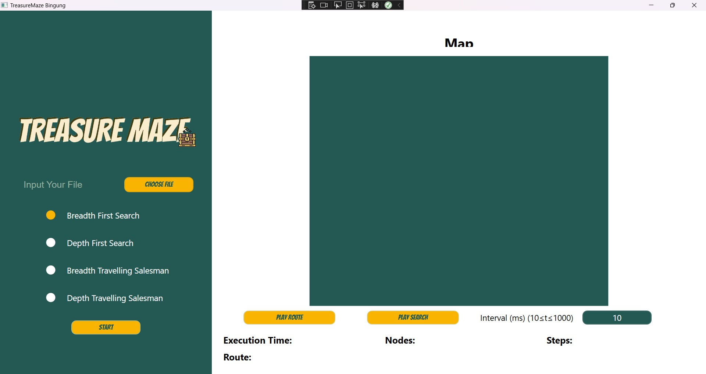
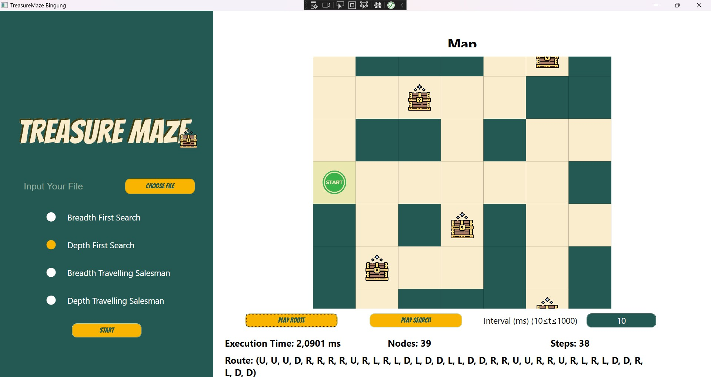

# IF2211_Strategi Algoritma
## *Tubes2_13521111_13521116_13521162*


## **Table of Contents**
* [Program Description](#program-description)
* [Required Program](#required-program)
* [How to Run The Program](#how-to-run-the-program)
* [How to Compile The Program](#how-to-run-the-program)
* [Program Usage Guide](#program-usage-guide)
* [Progress Report](#progress-report)
* [Authors](#authors)
* [Folders and Files Description](#folders-and-files-description)

## **Program Description**
This program is a treasure-collect and maze-solver program. The maze used by the program will be inputted from a .txt file. Therefore, users can custom the maze by their own willing. After reading section, the contents inside the .txt file will be converted into a matrix. There are several objects inside the maze itself, which are walls, routes, and treasures. The goal of the program is to find a route, from a starting coordinate, to collect all the treasures within the maze. This problem will be solved using BFS (*Breadth-First-Search*) and DFS (*Depth-First-Search*) algorithm. The output of the program is a GUI (*graphical user interface*) to display the solution of the given problems.

## **Required Program**
Here are the required programs you need to prepare to run the program in this repository:
| Required Program      | Reference Link |
|-----------------------|----------------|
| .Net                  | [.Net](https://dotnet.microsoft.com/en-us/download) |
| Visual Studio |  [Visual Studio](https://visualstudio.microsoft.com/)|
 
## **How to Run The Program**
1. Clone this repository (skip if the step is done)</br>
```sh
git clone https://github.com/Gulilil/Tubes2_bingung.git
```
2. Change the current directory into the cloned repository </br>
```sh
cd Tubes2_bingung
```
3. Run the executable file inside the `bin` folder </br>
```sh
bin\Debug\TreasureMaze.exe
# or
.bin\Debug\TreasureMaze.exe
```

## **How to Compile The Program**
Under ideal circumstances, you just need to run the executable program inside the `bin` folder to run the program. Therefore you can follow the steps in [How To Run The Program](#how-to-run-the-program). However, if it does not work, you can try to recompile the program following these steps:
1. Clone this repository (skip if the step is done)</br>
```sh
git clone https://github.com/Gulilil/Tubes2_bingung.git
```

2. Open the cloned repository using Visual Studio. </br>

3. In the solution explorer, double click the .csproj file to open it. </br>

4. To run the program, click the button at top center of Visual Studio. The one that indicates it is used to run the program. On the other hand, you can also click 'F5' to run the program. </br>

## **Program Usage Guide**


Here is the initial display of the program when it is started. To input the desired txt file, user can click the `Choose File` button on the left side of the program display. Next, user can choose one of the method options that the program will use to solve the given problem. Lastly, to execute the program, user needs to click the `START` button.


After the program successfully the map, validated map will be displayed on the right side of the program display. The solution will be displayed on the right bottom of the program display. 
<ul>
    <li> Execution time indicates the duration that the program took to solve the given problems.
    <li> Nodes represents the amount of created nodes during the solution finding.
    <li> Steps represents the amount of steps, needed to be taken, to travel from the initial grid to all the treasures in the map.
    <li> Route displays the solution's steps direction.
</ul>


## **Progress Report**

| Points        | Done  |
|---------------|-------|
| The program can be compiled without any issues |  &check; |
| The program can be runned | &check;  |
| The program can accept and validate input |  &check; |
| The program successfully solve the given problem using BFS and DFS methods and able to display the solution as an output   |  &check; |
| The solution given by the program contains the route that visit all the treasures location in the given map    |  &check; |
| The program can display GUI that contains given minimum specifications for GUI |  &check; |
| Implemented first bonus aspect (grid finding process) |   |
| Implemented second bonus aspect (TSP problem solution) | &check; |
| Implemented third bonus aspect (explanation video) |   |

## **Authors** 
| Name | ID |
|-----|----|
| Tabitha Permalla | 13521111 | 
| Juan Christopher Santoso | 13521116 | 
| Antonio Natthan Krishna | 13521162 | 


## **Folders and Files Description**
    .   
    ├─ .vs
    ├─ bin                              # Contains compiled program
    ├─ doc                              # Contains complete documentation file of the program
    ├─ obj                              # Appear locally if you have tried to compile the program
    ├─ Properties
    ├─ src                              # Contains every algorithm in constructing the program
        ├─ class                            # Contains fundamental classes used in the program
            ├─ Map.cs
            ├─ Point.cs
            ├─ Route.cs
            ├─ Tile.cs
        ├─ method                           # Contains the solving algorithm of the given problem
            ├─ BFS.cs
            ├─ DFS.cs
            ├─ Solver.cs
        ├─ MainWindow.xaml.cs
    ├─ test                             # Contains input files for the program
    ├─ .gitignore
    ├─ App.config
    ├─ App.xaml
    ├─ MainWindow.xaml
    ├─ README.md
    └─ TreasureMaze.csproj


